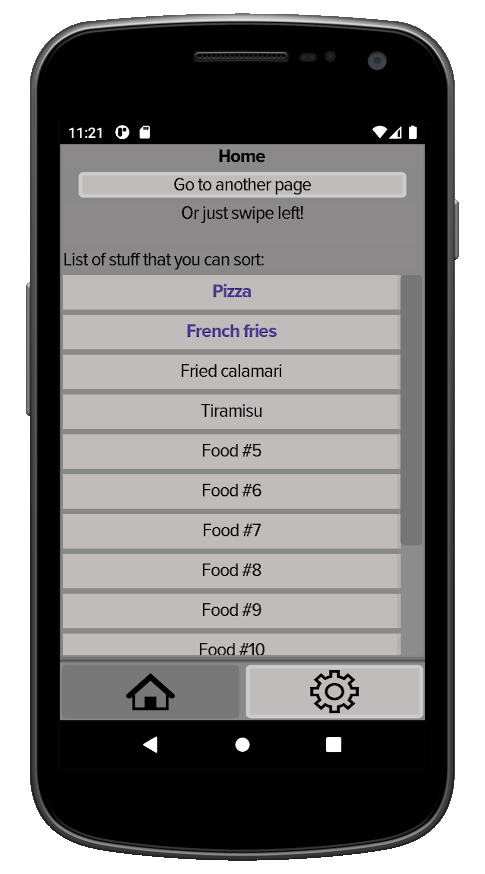

# Mobile App Template for Godot

A template to start creating mobile apps (not games) with [Godot](https://godotengine.org).

  

## Current features

* Export preset for Android.
* Fix to actually disable _immersive mode_.
* Window size and viewport settings.
* App state (previous page, page parenting, etc.).
* Scrolling up and down.
* Sorting items.
* Gray theme adapted for mobile covering most of the _Control_s.
* Customized _SpinBox_ with bigger buttons.
* Customized _Control_ _RichTextButton_ to have buttons with wrappable and multi-colored text.
* Utility functions in [_app_manager.gd_](src/scripts/app_manager.gd).

## Understanding the template

To know what's been changed in the project settings (_project.godot_), just open the file in a text editor and the variables that will appear are the ones that have been changed.
This works for _scene files_ too, but it's easier to just browse them inside _Godot's editor_, in fact it automatically opens the menus where parameters have been changed.

## Permissions

Enable the wanted permissions in the export preset. When testing, you'll export to a debug build, therefore no permissions will be asked, and you'll have to go to your OS app settings and manually enable the permissions (those that you selected in the preset will be available to be switched on).

## Possible future features

* Swiping.
* Customized _FileDialog_ (or I'll just wait for the ability to call the OS file manager).

## Contributing

See [contrib/](contrib/).
